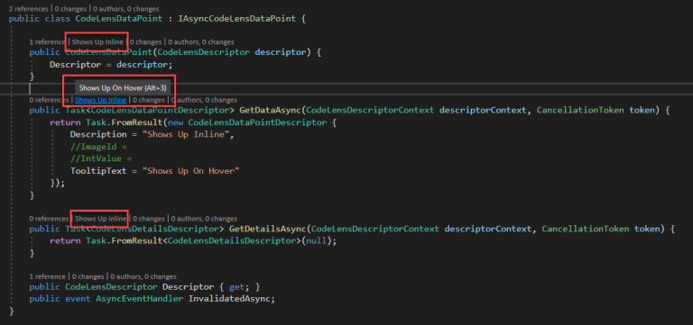
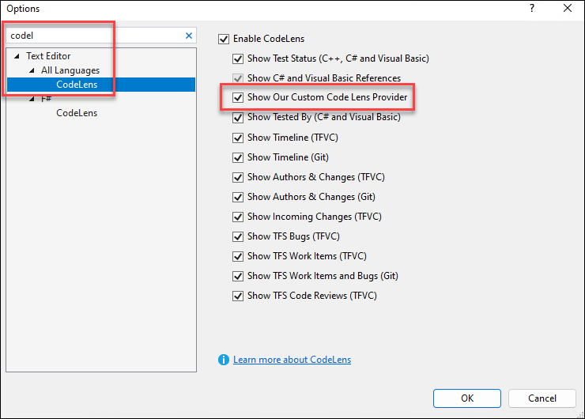

If you have your own Visual Studio extension, and you want to add your own custom CodeLens entries - I'm here to help, because I just (finally!) figured out how to do this (plus a few extras!)

First, let me start by saying that I've only "proven" this method with VS2019 and "disproven" it with VS2017, but I see no reason why it wouldn't / shouldn't work with VS2022. This mainly boils down to the various interfaces, packages / references that need to be used. Having said that, MAYBE it is possible in VS2017, but I'm not diving any deeper into that rabbit hole to figure it out.

The biggest things to note about extending CodeLens is that -

* It requires a separate project in your solution
* It runs out-of-process from your main extension / Visual Studio

With that in mind, let's jump into some code.

Like I said, first you'll need a new project within your existing Visual Studio extension solution. I won't go through that here, so let's assume you have a new, empty, `Class Library` project called `CodeLensProvider.csproj` in your (existing) Visual Studio extension solution.

You will need two new classes that follow a certain pattern to accomplish this. First, create a new class, `CodeLensDataPointProvider.cs` and implement the interface `IAsyncCodeLensDataPointProvider`. You should end up with something like this -

```csharp
public class CodeLensDataPointProvider : IAsyncCodeLensDataPointProvider {
    public Task<bool> CanCreateDataPointAsync(CodeLensDescriptor descriptor, CodeLensDescriptorContext context, CancellationToken token) {
        throw new NotImplementedException();
    }

    public async Task<IAsyncCodeLensDataPoint> CreateDataPointAsync(CodeLensDescriptor descriptor, CodeLensDescriptorContext context, CancellationToken token) {
        throw new NotImplementedException();
    }
}
```

Now create another new class, `CodeLensDataPoint.cs` and implement the interface `IAsyncCodeLensDataPoint`. You should end up with something like this -

```csharp
public class CodeLensDataPoint : IAsyncCodeLensDataPoint {
    public Task<CodeLensDataPointDescriptor> GetDataAsync(CodeLensDescriptorContext descriptorContext, CancellationToken token) {
        throw new System.NotImplementedException();
    }

    public Task<CodeLensDetailsDescriptor> GetDetailsAsync(CodeLensDescriptorContext descriptorContext, CancellationToken token) {
        throw new System.NotImplementedException();
    }

    public CodeLensDescriptor Descriptor { get; }
    public event AsyncEventHandler InvalidatedAsync;
}
```

Those are, technically speaking, the only two classes you should need for this basic example - we'll refine it later to add some more functionality.

Let's jump back to the `CodeLensDataPointProvider` class file, and work on that a little bit.

We need to decorate the class with some attributes to get things lined up and named correctly when this provider is loaded into Visual Studio -

```csharp
[Export(typeof(IAsyncCodeLensDataPointProvider))]
[Name(Id)]
[ContentType("CSharp")]
[LocalizedName(typeof(Resources), Id)]
[Priority(210)]
public class CodeLevelMetricsProvider : IAsyncCodeLensDataPointProvider 
{
    internal const string Id = "CustomCodeLensProvider";
    // snip for brevity in this example
}
```

Let's discuss each attribute and why we need it.

* `[Export(typeof(IAsyncCodeLensDataPointProvider))]`
  * This tells the `MEF` (Managed Extensibility Framework) framework that we have a custom code lens provider in this class.
* `[Name(Id)]`
  * Provides a unique name to the provider for internal usage. Note that we did also add the `internal const string Id = "CustomCodeLensProvider";` into the class so we could reference this value (we'll need it again here in a minute).
* `[ContentType("CSharp")]`
  * We only want our Custom CodeLens provider to work within CSharp (`.cs`) files. You can have multiple of these, of course, depending on what you need to target.
* `[LocalizedName(typeof(Resources), Id)]`
  * This one needs a `Resources.resx` file in the project, so go ahead and create that and add a single entry that matches the value of the `Id` field. This is where Visual Studio will get the "friendly" name for the provider for the options dialog (and maybe others?) That should look something like this -
  
* `[Priority(210)]`
  * This tells Visual Studio *WHERE* to place your Code Lens entry, in relation to other Code Lens entries. If the default configuration for Code Lens is utilized, this results in our entry being second in line, after the built-in "number of references" Code Lens entry that Visual Studio ships with.
  
Now, if we take a look at our `CodeLensDataPointProvider` class now, we should look like this -

```csharp
[Export(typeof(IAsyncCodeLensDataPointProvider))]
[Name(Id)]
[ContentType("CSharp")]
[LocalizedName(typeof(Resources), Id)]
[Priority(210)]
public class CodeLensDataPointProvider : IAsyncCodeLensDataPointProvider 
{
    internal const string Id = "CustomCodeLensProvider";

    public Task<bool> CanCreateDataPointAsync(CodeLensDescriptor descriptor, CodeLensDescriptorContext descriptorContext,
        CancellationToken token) {
        throw new System.NotImplementedException();
    }

    public Task<IAsyncCodeLensDataPoint> CreateDataPointAsync(CodeLensDescriptor descriptor, CodeLensDescriptorContext descriptorContext,
        CancellationToken token) {
        throw new System.NotImplementedException();
    }
}
```

One more thing to do, before we start writing "real" code, is to tell your extension that this CodeLens provider exists. We do that by modifying the `extension.vsixmanifest` file in your main project and adding a new entry to the `Assets` collection -

```xml
<Asset Type="Microsoft.VisualStudio.CodeLensComponent" d:Source="Project" d:ProjectName="CodeLensProvider" Path="|CodeLensProvider|" />
```

Between that entry, and the `Export(typeof(IAsyncCodeLensDataPointProvider))]`, everything should be "wired up" properly. Now that the "plumbing" is "done" - let's make it do something!

For this example, I want our entries to show up for methods - ONLY, and we can do that in the `CanCreateDataPointAsync` method of our provider, like so -

```csharp
public Task<bool> CanCreateDataPointAsync(CodeLensDescriptor descriptor, CodeLensDescriptorContext context, CancellationToken token) 
{
    var methodsOnly = descriptor.Kind == CodeElementKinds.Method;
    return Task.FromResult(methodsOnly);
}
```

And just so we can get this working, let's stub out the `CreateDataPointAsync` method so that it actually works -

```csharp
public Task<IAsyncCodeLensDataPoint> CreateDataPointAsync(CodeLensDescriptor descriptor, CodeLensDescriptorContext descriptorContext,
    CancellationToken token) {
    return Task.FromResult<IAsyncCodeLensDataPoint>(new CodeLensDataPoint(descriptor));
}
```

Back over in the `CodeLensDataPoint` class file, let's stub out those methods as well (and add a constructor) -

```csharp
public class CodeLensDataPoint : IAsyncCodeLensDataPoint 
{
    public CodeLensDataPoint(CodeLensDescriptor descriptor) {
        Descriptor = descriptor;
    }
  
    public Task<CodeLensDataPointDescriptor> GetDataAsync(CodeLensDescriptorContext descriptorContext, CancellationToken token) {
        return Task.FromResult(new CodeLensDataPointDescriptor {
            Description = "Shows Up Inline",
            //ImageId = Shows an image next to the Code Lens entry
            //IntValue = I haven't figured this one out yet!
            TooltipText = "Shows Up On Hover"
        });
    }

    public Task<CodeLensDetailsDescriptor> GetDetailsAsync(CodeLensDescriptorContext descriptorContext, CancellationToken token) {
        // this is what gets triggered when you click a Code Lens entry, and we don't really care about this part for now
        return Task.FromResult<CodeLensDetailsDescriptor>(null);
    }

    public CodeLensDescriptor Descriptor { get; }
    public event AsyncEventHandler InvalidatedAsync;
}
```

Now with any luck, this will build, and you can run it in the Experimental instance of Visual Studio!

Opening the same solution / project in the Experimental instance, you should get something like this (sorry for the highlighting difference between code and screenshot here) -



As you can see, our `Description` property shows up inline (second because of our `Priority`) of the other CodeLens entries, `TooltipText` shows up when hovering the entry, and since we return a `null` `CodeLensDetailDescriptor` from our `GetDetailsAsync`, clicking on the CodeLens entry pops up a secondary pane with no data as seen below -


Finally, you can disable our "Custom Code Lens Provider" by unchecking the box in the CodeLens settings of the Options dialog -



---

There you have it - a working Code Lens provider for Visual Studio! I'm going to end this post here, as it's getting a bit long, but I'll follow up in a short while to illustrate something that I ran into (and maybe you haven't considered this yet, but...), since the Code Lens process runs "out of process" with your main extension / Visual Studio - your custom Code Lens provider can't talk to your main extension if you need any services / data / etc., that you already have in place there.

So, Part II will discuss how to get the Code Lens provider talking to the main extension / project. And while it solves HALF of the communication issue, Part III will go into greater depths on how to get TWO-WAY communication between them. As a teaser- RPC HERE WE COME!

---

With that, if you made it this far, thank you, friend. I hope you enjoyed or learned something from the various trials and tribulations I've been through over the past couple weeks trying to get all of this working. I've gotten very good at advanced GitHub searches, though 😊.

A lot of the detail from this is coming from the [example project posted on GitHub by Microsoft](https://github.com/microsoft/VSSDK-Extensibility-Samples/tree/master/CodeLensOopSample) - however, in my opinion, it leaves a lot to be desired, so I'm hoping I can fill in the gaps (especially with Parts II and III). Stay tuned!
